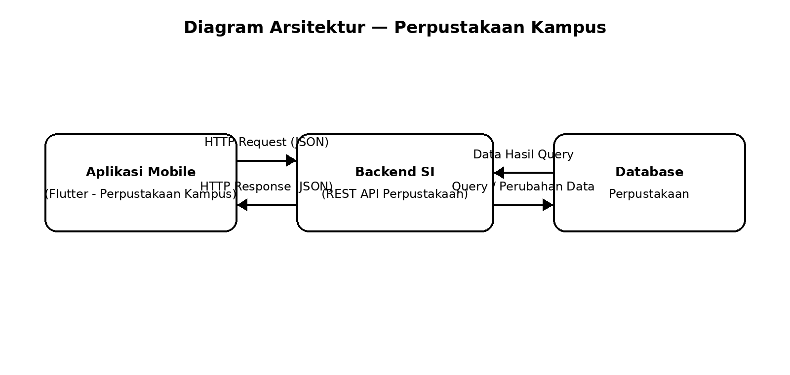

# Tugas 1 — Identifikasi Kebutuhan Aplikasi Bergerak

### Aplikasi Mobile Perpustakaan Kampus

|                    |                        |
| :----------------- | :--------------------- |
| **Nama**           | Billy Apandisastra         |
| **NIM**            | 230660221112            |
| **Kelas**          | SI-VIIA               |
| **Domain SI**      | Perpustakaan Kampus    |

---

## Daftar Isi

1. [Deskripsi Sistem](#1-deskripsi-sistem)
2. [Diagram Arsitektur](#2-diagram-arsitektur)
3. [Tabel Kebutuhan](#3-tabel-kebutuhan)
4. [Bukti Environment Siap](#4-bukti-environment-siap)
5. [Refleksi](#5-refleksi)

---

## 1. Deskripsi Sistem

### Pengguna

- **Mahasiswa** — pengguna utama aplikasi.
- **Petugas Perpustakaan** — pengguna pendukung dalam pengelolaan layanan perpustakaan dari sisi backend.

### Permasalahan

1. Mahasiswa perlu mengetahui ketersediaan buku tanpa harus datang langsung ke perpustakaan.
2. Mahasiswa membutuhkan informasi peminjaman dan status buku secara lebih cepat dan praktis.

### Alasan Memilih Aplikasi Mobile

| Karakteristik Mobile | Penerapan pada Sistem |
| :--- | :--- |
| **Konteks bergerak** | Mahasiswa dapat mengakses informasi perpustakaan melalui perangkat yang mereka bawa sehari-hari saat beraktivitas di lingkungan kampus. |
| **Interaksi sentuh** | Mahasiswa dapat menggunakan layar sentuh untuk mencari buku, melihat detail buku, dan memantau status peminjaman dengan cepat. |
| **Sesi penggunaan singkat** | Informasi seperti katalog, detail buku, dan status peminjaman dapat diakses dalam beberapa langkah sederhana. |

---

## 2. Diagram Arsitektur

> **File sumber:** `diagram.mmd` (Mermaid)

### Alur Komunikasi

1. Aplikasi Mobile mengirim **HTTP Request (JSON)** ke Backend SI.
2. Backend SI melakukan **query atau perubahan data** pada Database Perpustakaan.
3. Database mengembalikan **data hasil query** kepada Backend SI.
4. Backend SI mengirim **HTTP Response (JSON)** kembali ke Aplikasi Mobile.

---

## 3. Tabel Kebutuhan

| No. | Permintaan | Pengguna | Karakteristik Mobile yang Terkait | Fitur Aplikasi | Materi Pemenuh |
| :---: | :--- | :---: | :--- | :--- | :---: |
| 1 | Melihat daftar buku yang tersedia di perpustakaan | Mahasiswa | Layar kecil dan sesi singkat: informasi buku harus mudah ditemukan | Halaman daftar katalog buku | `Minggu 3, 5` |
| 2 | Mencari buku berdasarkan informasi yang tersedia | Mahasiswa | Interaksi sentuh dan sesi singkat: pencarian dapat dilakukan dengan cepat melalui perangkat mobile | Fitur pencarian buku | `Minggu 3, 5` |
| 3 | Melihat detail informasi buku | Mahasiswa | Layar kecil: informasi disajikan secara ringkas dan terstruktur | Halaman detail buku | `Minggu 5` |
| 4 | Memantau status peminjaman buku | Mahasiswa | Konteks bergerak: status peminjaman dapat diperiksa melalui perangkat mobile | Halaman status peminjaman | `Minggu 6, 9–10` |
| 5 | Mengelola data buku dan informasi perpustakaan | Petugas | Tidak berlaku secara langsung karena merupakan pekerjaan sisi server | Pengelolaan data melalui Backend SI / REST API | Di luar PAB |

> **Catatan Lingkup:** Baris 1–4 merupakan kebutuhan yang ditampilkan pada aplikasi mobile, sedangkan pengelolaan data oleh petugas dilakukan melalui sisi backend sistem informasi.

---

## 4. Bukti Environment Siap

| Bukti | File |
| :--- | :--- |
| `flutter doctor -v` sebelum perbaikan | `flutter-doctor/sebelum.png` |
| `flutter doctor -v` sesudah perbaikan | `flutter-doctor/sesudah.png` |
| Aplikasi Flutter berjalan pada target Web/Chrome | `aplikasi.png` |

### Environment Pengembangan

- **Flutter:** 3.47.4
- **Dart:** 3.13.3
- **Target:** Web
- **Browser:** Google Chrome
- **Sistem Operasi:** Windows
- **Project:** `pab_p1_230660221112`

---

## 5. Refleksi

> **Fitur perangkat yang paling relevan: Interaksi layar sentuh**

Fitur interaksi layar sentuh relevan karena pengguna utama aplikasi adalah mahasiswa yang mengakses sistem melalui perangkat mobile. Pengguna dapat melakukan pencarian buku, melihat detail buku, dan memantau status peminjaman melalui beberapa sentuhan pada layar. Dengan demikian, informasi perpustakaan dapat diakses secara lebih praktis ketika mahasiswa sedang beraktivitas di lingkungan kampus.

---

**Billy Apandisastra — 230660221112 — SI-VIIA**

