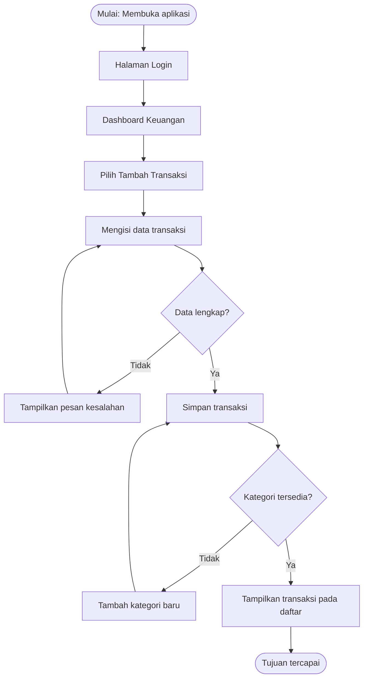

# Dokumen Kebutuhan Aplikasi MoneyTrack Mahasiswa

## 1. Deskripsi Aplikasi

MoneyTrack Mahasiswa adalah aplikasi mobile yang membantu mahasiswa mencatat, memantau, dan mengelola keuangan pribadi. Permasalahan yang dihadapi pengguna adalah kesulitan mencatat transaksi harian, mengetahui jumlah pengeluaran, dan mengontrol kondisi keuangan secara berkala. Solusi berbentuk aplikasi mobile dipilih karena smartphone mudah dibawa sehingga mahasiswa dapat melakukan pencatatan transaksi kapan saja dan di mana saja.

## 2. User Persona

### Persona 1 — Raka — Mahasiswa Pengguna

| Komponen | Isi |
|---|---|
| Nama dan peran | Raka — mahasiswa pengguna aplikasi keuangan |
| Tujuan | Mencatat pemasukan dan pengeluaran untuk mengontrol keuangan |
| Kendala | Sering lupa mencatat transaksi kecil dan sulit mengetahui total pengeluaran |
| Perangkat dan konteks | Smartphone saat di kampus, kos, atau perjalanan |
| Frekuensi penggunaan | Setiap hari setelah melakukan transaksi |

### Persona 2 — Admin Sistem — Pengelola Aplikasi

| Komponen | Isi |
|---|---|
| Nama dan peran | Admin Sistem — pengelola layanan aplikasi |
| Tujuan | Memastikan sistem berjalan dan data pengguna terkelola |
| Kendala | Membutuhkan pemantauan agar layanan tetap berjalan baik |
| Perangkat dan konteks | Komputer atau smartphone saat mengelola sistem |
| Frekuensi penggunaan | Secara berkala sesuai kebutuhan |

## 3. Kebutuhan Fungsional

| ID | Rumusan Kebutuhan | Persona | Cara Verifikasi |
|---|---|---|---|
| F-01 | Mahasiswa dapat melihat ringkasan kondisi keuangan untuk mengetahui pemasukan dan pengeluaran | Persona 1 | Membuka dashboard dan memastikan ringkasan tampil |
| F-02 | Mahasiswa dapat menambahkan transaksi baru agar data keuangan tersimpan | Persona 1 | Mengisi form transaksi dan memastikan data masuk daftar |
| F-03 | Mahasiswa dapat melihat riwayat transaksi untuk memantau aktivitas keuangan | Persona 1 | Membuka halaman riwayat dan melihat data transaksi |
| F-04 | Mahasiswa dapat mengubah data transaksi agar informasi tetap sesuai | Persona 1 | Mengedit transaksi dan memastikan perubahan tersimpan |
| F-05 | Mahasiswa dapat menghapus transaksi agar data yang tidak diperlukan dapat dihilangkan | Persona 1 | Menghapus transaksi dan memastikan data tidak tampil |
| F-06 | Admin dapat mengelola data aplikasi agar layanan berjalan dengan baik | Persona 2 | Admin dapat melakukan pengelolaan data |

## 4. Kebutuhan Nonfungsional

| ID | Kategori | Rumusan | Kriteria Terukur |
|---|---|---|---|
| NF-01 | Kinerja | Aplikasi menampilkan daftar transaksi pengguna | Data tampil maksimal 3 detik |
| NF-02 | Kegunaan | Pengguna dapat melakukan pencatatan transaksi | Proses selesai maksimal 5 langkah |

## 5. Prioritas MoSCoW

| Prioritas | ID | Alasan |
|---|---|---|
| Must Have | F-01, F-02, F-03, F-04 | Fitur utama yang dibutuhkan mahasiswa untuk mencatat dan memantau keuangan |
| Should Have | F-05 | Membantu menjaga data transaksi tetap akurat |
| Could Have | F-06 | Mendukung pengelolaan aplikasi oleh admin |
| Won't Have (saat ini) | Notifikasi pengingat otomatis | Ditunda karena fokus awal aplikasi adalah pencatatan keuangan |

## 6. User Flow

Nama alur: Menambahkan transaksi keuangan

Aktor: Mahasiswa

Tujuan: Transaksi berhasil tersimpan.

## 7. Pemetaan Kebutuhan ke Antarmuka

| ID | Prioritas | Halaman | Widget |
|---|---|---|---|
| F-01 | Must | Dashboard Keuangan | Scaffold, AppBar, Card |
| F-02 | Must | Form Transaksi | Column, TextField, Button |
| F-03 | Must | Riwayat Transaksi | ListView.builder, ListTile |
| F-04 | Must | Detail Transaksi | Card, Button |
| F-05 | Should | Detail Transaksi | Button |
| F-06 | Could | Halaman Admin | ListView |

