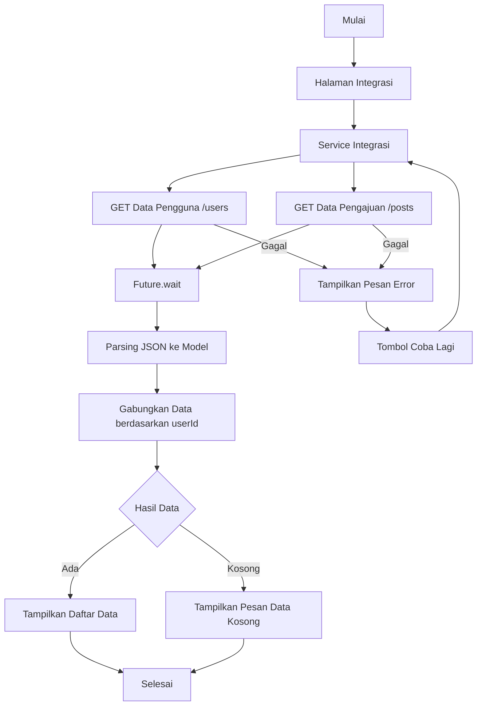

# Diagram Alur Integrasi Data

```mermaid
flowchart TD
    A[Mulai] --> B[Halaman Integrasi]
    B --> C[Service Integrasi]
    C --> D[GET Data Pengguna /users]
    C --> E[GET Data Pengajuan /posts]
    D --> F[Future.wait]
    E --> F
    F --> G[Parsing JSON ke Model]
    G --> H[Gabungkan Data berdasarkan userId]
    H --> I{Hasil Data}
    I -->|Ada| J[Tampilkan Daftar Data]
    I -->|Kosong| K[Tampilkan Pesan Data Kosong]
    D -->|Gagal| L[Tampilkan Pesan Error]
    E -->|Gagal| L
    J --> M[Selesai]
    K --> M
    L --> N[Tombol Coba Lagi]
    N --> C
```
