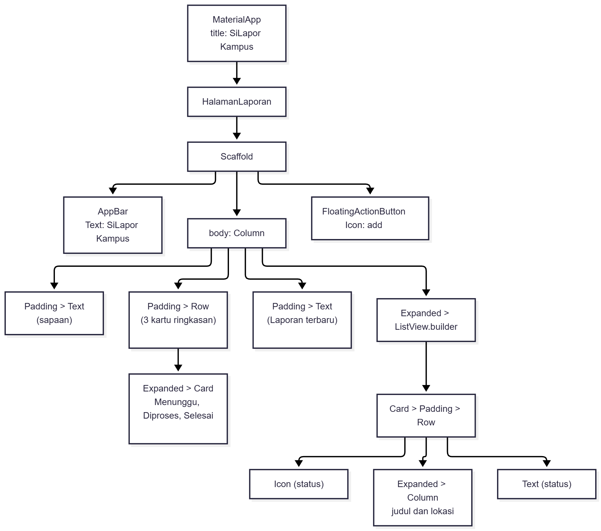
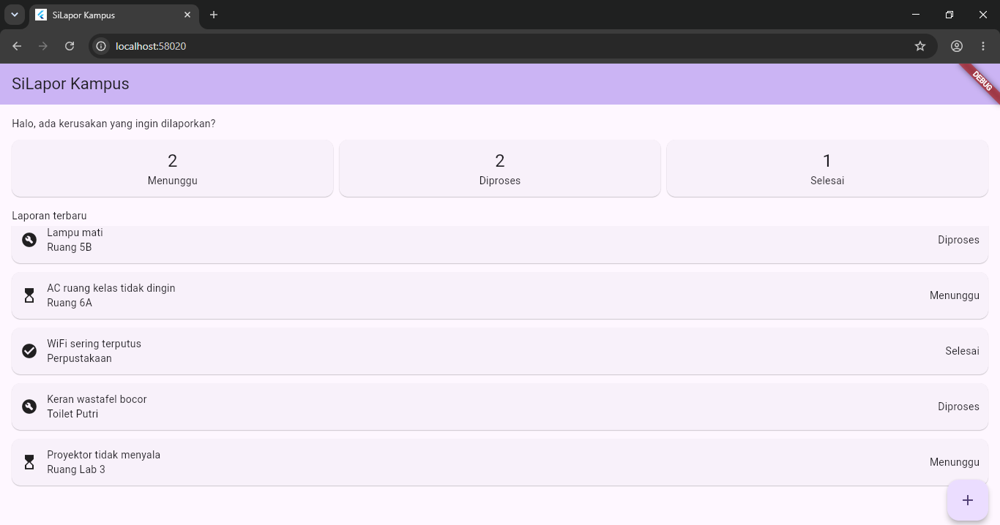

# Tugas 3: Halaman Aplikasi Sederhana

| | |
|:--|:--|
| **Nama** | Galih Permana Sidik |
| **NIM** | 230660221002 |
| **Kelas** | SI-VIIA |
| **Nama Aplikasi** | SiLapor Kampus |
| **Domain SI** | Pengaduan kerusakan fasilitas kampus |

---

## Deskripsi Halaman

Halaman ini adalah beranda SiLapor Kampus yang dilihat mahasiswa setelah membuka aplikasi. Bagian atas berisi sapaan dan tiga kartu ringkasan yang menghitung laporan berstatus Menunggu, Diproses, dan Selesai. Di bawahnya, daftar laporan terbaru ditampilkan dengan `ListView.builder`, lengkap dengan ikon status, judul kerusakan, dan lokasinya. Datanya berupa lima entri statis di dalam kode, sehingga halaman bisa dijalankan tanpa API maupun database.

## Widget Tree

## Screenshot

## Refleksi

Widget yang paling sulit saya rangkai adalah `ListView.builder` di dalam `Column`, karena tanpa `Expanded` halaman langsung menampilkan error `RenderFlex overflow`. Penyebabnya, `Column` memberi ruang tak terbatas kepada anaknya sehingga `ListView` tidak tahu tinggi maksimum yang boleh dipakai. Setelah dibungkus `Expanded`, daftar mengisi sisa layar di bawah kartu ringkasan dan bisa digulir dengan normal.
