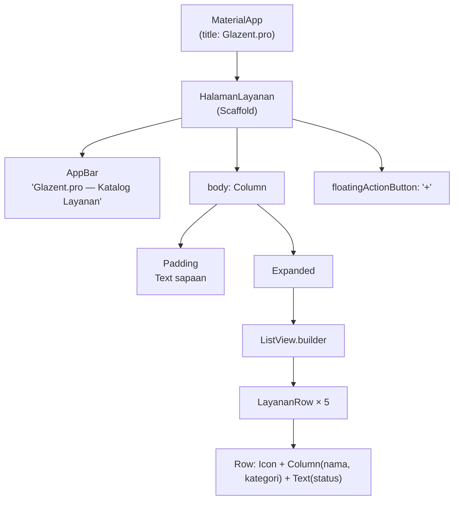
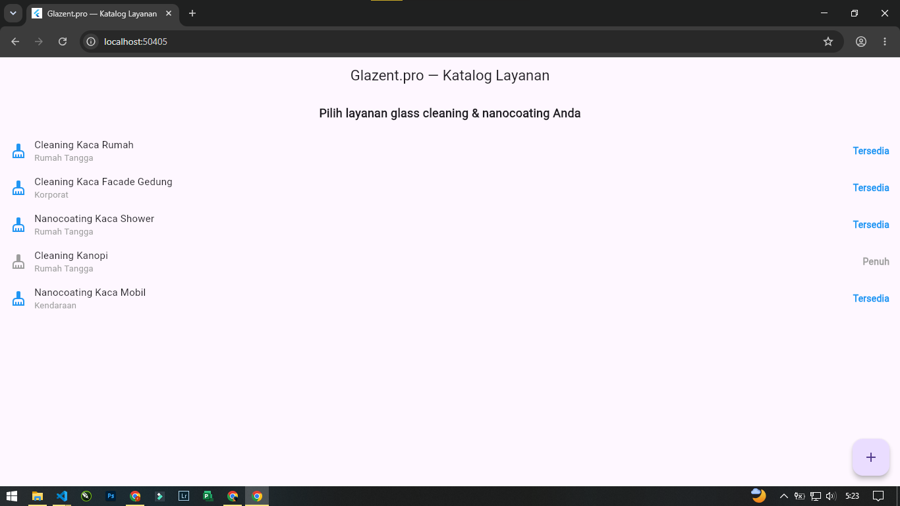

# Tugas 3 — Halaman Aplikasi Sederhana

| | |
|:--|:--|
| **Nama** | FAJAR |
| **NIM** | 230660221093 |
| **Kelas** | SI-VIIA |
| **Domain** | Usaha mikro jasa — Glazent.pro (glass cleaning & nanocoating) |
| **Nama Aplikasi** | Glazent.pro — Katalog Layanan |

---

## 1. Deskripsi Halaman

Halaman ini menampilkan **katalog layanan** Glazent.pro, yaitu daftar jasa glass cleaning dan nanocoating yang dapat dipesan pelanggan (cleaning kaca rumah, cleaning kaca facade gedung, nanocoating kaca shower, cleaning kanopi, dan nanocoating kaca mobil). Setiap baris pada daftar menampilkan ikon, nama layanan, kategori (rumah tangga, korporat, atau kendaraan), dan status ketersediaan yang berubah warna tergantung apakah layanan tersebut masih bisa dipesan ("Tersedia") atau sedang penuh ("Penuh"). Halaman ini menjadi titik awal alur pemesanan yang akan dikembangkan lebih lanjut pada pertemuan berikutnya, misalnya dengan menambahkan form pemesanan saat salah satu layanan ditekan.

## 2. Widget Tree

File sumber: [`widget-tree.mmd`](widget-tree.mmd) (Mermaid).

## 3. Layout yang Digunakan

| Layout | Lokasi pemakaian |
|:-------|:------------------|
| `Column` | Menyusun `body` secara vertikal: teks sapaan di atas, daftar layanan di bawah |
| `Padding` | Memberi spasi 16 piksel di sekeliling teks sapaan |
| `Row` (dalam `LayananRow`) | Menyusun ikon, nama+kategori, dan status secara horizontal dalam satu baris |
| `ListView.builder` | Menampilkan daftar layanan yang dapat digulir, dibungkus `Expanded` agar tidak terjadi `RenderFlex overflow` |

## 4. Screenshot Hasil

## 5. Refleksi

 Layout yang paling sulit saya rangkai adalah Expanded di dalam Column. Awalnya saya menaruh ListView.builder langsung sebagai anak Column tanpa membungkusnya, dan muncul error RenderFlex overflow karena keduanya sama-sama mencoba mengatur tinggi sendiri. Setelah saya bungkus dengan Expanded, ListView mengisi sisa ruang yang tersedia dan error tersebut hilang.
