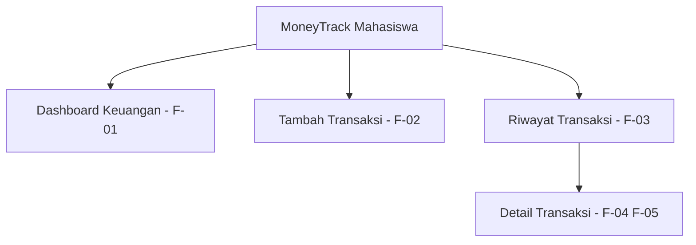

# Information Architecture - MoneyTrack Mahasiswa

## Inventaris Layar

| ID Layar | Nama Layar | Kebutuhan |
|---|---|---|
| L-01 | Dashboard Keuangan | F-01 |
| L-02 | Tambah Transaksi | F-02 |
| L-03 | Riwayat Transaksi | F-03 |
| L-04 | Detail Transaksi | F-04, F-05 |

## Diagram IA

## Alasan Layar Utama

Dashboard Keuangan dipilih sebagai layar utama karena memenuhi kebutuhan Must Have yaitu melihat kondisi keuangan dan menjadi pusat aktivitas pengguna.
